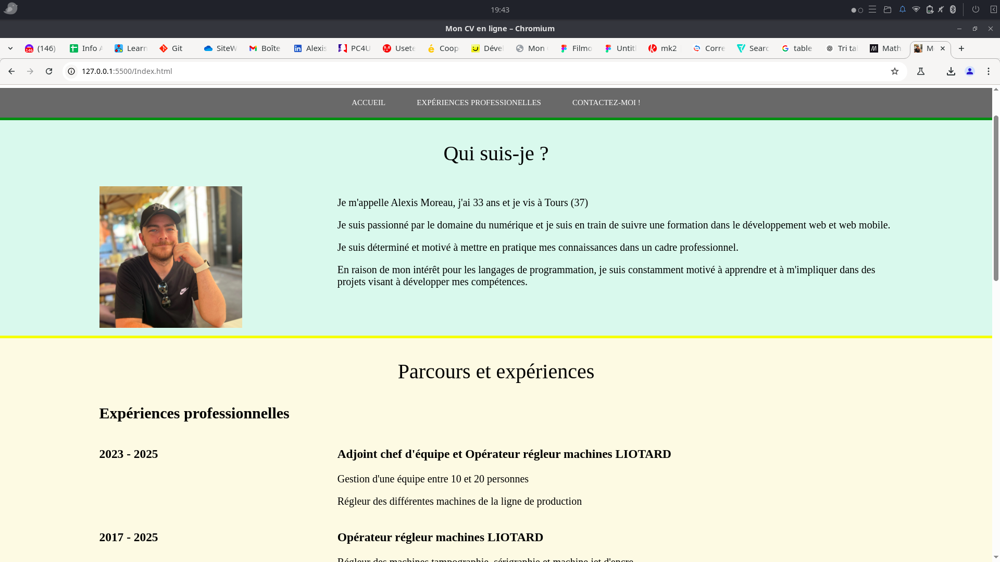

# Projet Site CV Version 1.0

Suite à ma première formation en ligne de développeur web et web mobile, j'ai eu à faire un petit site web CV pour mettre en pratique mes connaissances acquises

ouvrir en premier le fichier Index.html

## 🛠️Compérences :

## 🔗Liens :

